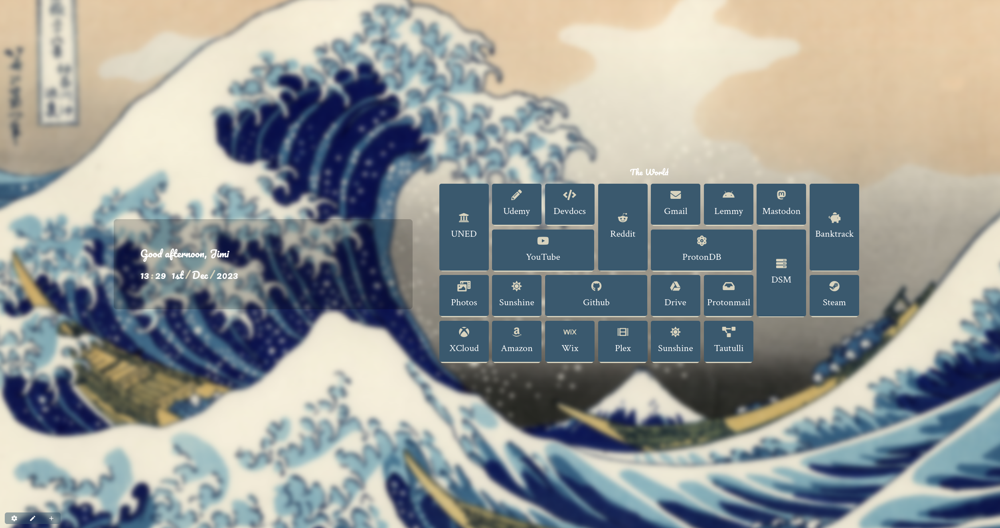

# Night Tab - A collection

> [!IMPORTANT]
> READ THROUGH CAREFULLY

A growing collection for [nightTab](https://github.com/zombieFox/nightTab), an effective yet simplistic `new tab customizer`

Table of Contents

- [Night Tab - A collection](#night-tab---a-collection)
- [How-to](#how-to)
- [Tabs](#tabs)
  - [Main](#main)
    - [1. Aesthetic Night](#1-aesthetic-night)
    - [2. Catppuccin](#2-catppuccin)
    - [3. Catppuccin personal](#3-catppuccin-personal)
    - [4. Kanagawa](#4-kanagawa)
    - [5. Minimal Forest](#5-minimal-forest)
    - [6. Walker](#6-walker)
    - [7. Hollow Night](#7-hollow-night)
  - [laggy-tux](#laggy-tux)
    - [1. Wabes](#1-wabes)
    - [2. Wabes-2](#2-wabes-2)
    - [3. Ocean](#3-ocean)
    - [4. Damascus](#4-damascus)
    - [5. catppuccin-mushroom](#5-catppuccin-mushroom)
- [License](#license)
- [Credits](#credits)

# How-to

1. Go ahead and download the plugin for ur preferred browser from [here](https://github.com/zombieFox/nightTab)

2. Go to _settings/data/import from file_

3. Choose your preferred theme and use it! Boom!

4. For more power... go ahead and read through the [Docs](https://github.com/zombieFox/nightTab#support)

> [!NOTE]
> If you're new to GitHub click on the green button saying **code** and click on _Download ZIP_

# Tabs

## Main

### 1. Aesthetic Night

_created by [u/TheDebtCollector\_\_](https://www.reddit.com/r/nighttab/comments/xney55/aesthetic_night_theme/)_

### 2. Catppuccin

### 3. Catppuccin personal

### 4. Kanagawa

_created by [u/Zapapala](https://www.reddit.com/r/nighttab/comments/188as2z/kanagawa_in_nighttab/)_

### 5. Minimal Forest

_created by [u/zcode9343](https://www.reddit.com/r/nighttab/comments/17w4kr9/minimal_forest_theme_httpspastebincomzgfe4dku/)_

### 6. Walker

_created by [u/Walker0712](https://www.reddit.com/r/nighttab/comments/18ocrf2/first_time_using_nighttab_end_up_customizing/)_

### 7. Hollow Night

_created by [u/Cultural-Duck-6766](https://www.reddit.com/r/nighttab/comments/18w3maa/hollow_knight_tab_for_everyone_o_heres_the_link/)_

## laggy-tux

### 1. Wabes

### 2. Wabes-2

### 3. Ocean

### 4. Damascus

_forked from [u/Ttl001](https://www.reddit.com/r/nighttab/comments/15a0fio/my_nighttab_setup/)_

### 5. catppuccin-mushroom

# License

The collection is released under the [GPL-3.0 License](https://opensource.org/licenses/GPL-3.0).

# Credits

The [other](#other) themes are forked from [laggy-tux](https://github.com/laggy-tux/NightTab-Collection)

&nbsp;

	
    <i>happy theming!</i>

